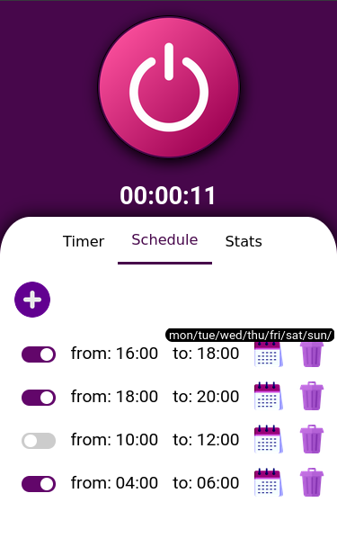
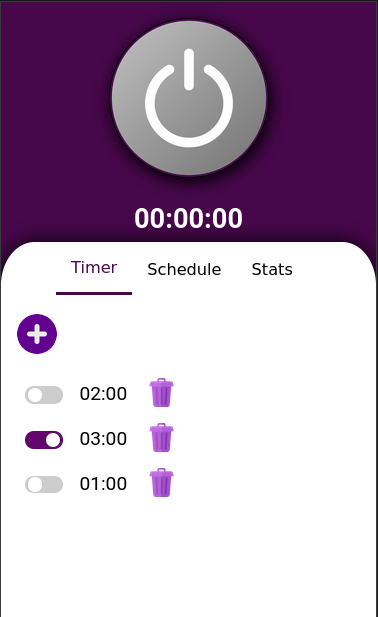

# Wifi socket webapp

This web application allows you to easily control your WiFi smart socket, just like the original manufacturer's app. However, there are a few prerequisites that you need to fulfill before you can use this app. Firstly, you need to flash your device with the firmware found at this link: https://drive.google.com/drive/folders/1HWl-QiYM2u8lW9TAv1M6Kr9DPkj1_wRG?usp=sharing. Secondly, you can find the necessary code in this GitHub repository: https://github.com/ljalves/hfeasy. Additionally, you need to create a MongoDB Atlas cluster, as the database is necessary for the server script to send requests from the client to the device. 
Finally, you should create a .env file inside wifi-socket/src where you can specify the MongoDB URL and the server port. Once you have fulfilled these prerequisites, you can proceed with the build/installation/setup process.

To do this, simply clone this repository, and once the installation is complete, navigate to /wifi-socket, install the dependencies, and build the app using the following commands: 

```
npm install
npm run-script build
```

To set up the environment, we suggest using a screen, and running :

```
npm start
node server.js
python3 socket-server.py
```





